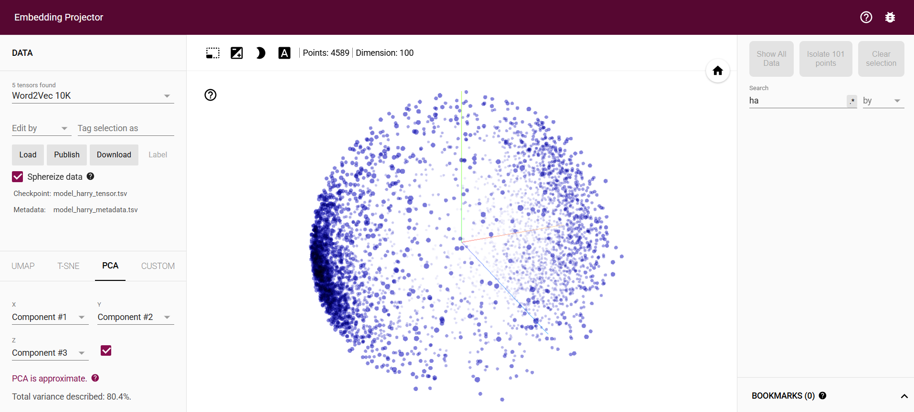
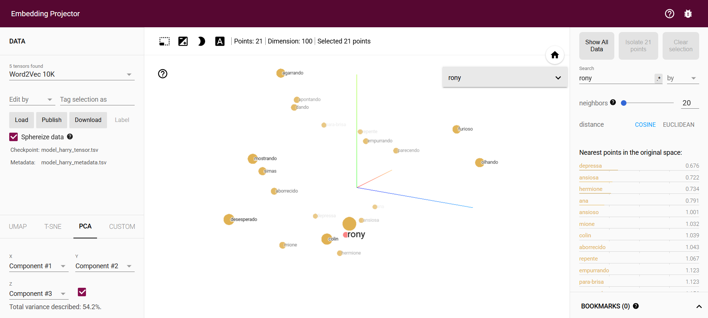

## TPC9

Neste trabalho foi desenvolvido um modelo de *Word Embeddings* utilizando o algoritmo Word2Vec, com o objetivo de analisar relações semânticas presentes nos dois primeiros livros da saga *Harry Potter*. O modelo permite representar palavras como vetores num espaço contínuo, capturando relações de contexto entre personagens, locais e conceitos do universo da obra.

Os ficheiros .txt utilizados continham várias quebras de linha (\n) no meio de frases, devido à formatação original dos livros. Para resolver este problema, foi utilizada a biblioteca spaCy, de forma a segmentar corretamente o texto em frases e posteriormente em palavras. Durante este processo, foram removidas pontuações e espaços.

O modelo foi treinado com a seguinte configuração:

```
model=Word2Vec(frases, vector_size=100, window=5, min_count=3, sg=0, epochs=20, workers=3)
```

As configurações do modelo foram ajustadas tendo em conta a natureza dos textos e os resultados obtidos. O parâmetro `min_count=3` foi definido de forma a ignorar palavras muito raras, que não acrescentam informação relevante sobre o universo de *Harry Potter*, dado que termos importantes tendem a ocorrer várias vezes ao longo dos livros. Já o número de `epochs=20` foi definido para permitir um número maior de passagens dos textos utilizados no treino do modelo, melhorando assim a qualidade dos vetores aprendidos e a estabilidade das relações semânticas.

Após o treino, foi utilizado `model.wv`, que contém os vetores das palavras aprendidas. Esta estrutura permite aceder às representações vetoriais e aplicar funções como:

- `most_similar`: para encontrar palavras semanticamente próximas;

- `similarity`: para calcular a similaridade entre dois termos;

- `doesnt_match`: para identificar palavras que não pertencem a um conjunto coerente.

Através da função `most_similar`, foram analisadas palavras como "Harry", "Hermione", "Draco", "Grifinória", "Hogwarts" e "Basilísco". O modelo conseguiu identificar algumas relações coerentes, como a proximidade entre os membros do trio principal ("Harry", "Ron" e "Hermione"), embora os resultados nem sempre fossem consistentes devido ao ruído presente no texto.

Com a função `similarity`, observou-se, por exemplo, que a similaridade entre "Harry" e "Rony" é superior à similaridade entre "Harry" e "Hermione", o que faz sentido no contexto dos primeiros livros, onde a interação entre Harry e Rony é mais frequente e direta.

A função `doesnt_match` foi utilizada para identificar palavras intrusas em conjuntos semânticos. Nos testes realizados, o modelo conseguiu identificar corretamente o intruso em conjuntos como o trio principal (Harry, Rony e Hermione) com a adição de Draco, bem como as casas de hogwarts e hogwarts em si e com um conjunto composto por professores e uma personagem não pertencente a esse grupo.

Para além das análises de similaridade direta, foram testadas diferentes analogias vetoriais com o objetivo de avaliar até que ponto o modelo consegue capturar relações semânticas mais complexas no universo de *Harry Potter*. Para tal, utilizou-se novamente a função `most_similar`, configurada com os argumentos `positive`, que agrupa os vetores dos conceitos que se pretendem somar (associar), e `negative`, que indica os vetores a subtrair (dissociar)

A primeira analogia, *(Grifinória + Snape − Harry)*, tinha como objetivo isolar a associação de Snape à sua casa. Esperava-se que o modelo destacasse principalmente "Sonserina" e conceitos relacionados. O resultado foi parcialmente consistente, uma vez que surgem termos como *Sonserina* e outras casas de Hogwarts, mas o termo "poções" aparece com maior relevância devido à forte associação contextual de Snape com a disciplina de Poções.

A segunda analogia, *(Grifinória + Snape − McGonagall)*, pretendia reforçar a ligação entre Snape e a sua casa, como diretor desta, removendo a influência da diretora da casa da Grifinória, McGonagall. Neste caso, o modelo apresentou um resultado mais consistente, com "Sonserina" a surgir como uma das primeiras palavras, indicando uma melhor captura desta relação semântica.

Por fim, a terceira analogia, *(Vassoura + Pomo − Bola)*, procurava isolar o conceito de *Quadribol* a partir dos seus elementos principais. O resultado revelou uma abordagem diferente por parte do modelo, que associou estes termos a jogadores e personagens como Flint e Olívio, evidenciando que interpreta os objetos do jogo através dos seus utilizadores em vez de abstrair diretamente para o desporto.

De forma geral, estas experiências mostram que o modelo consegue capturar relações relativamente estruturadas, como associações entre personagens e casas de Hogwarts.

Por fim, o modelo foi exportado utilizando:

```
python -m gensim.scripts.word2vec2tensor -i model_harry.txt -o model_harry
```

Os ficheiros gerados foram carregados na ferramenta TensorFlow Projector (http://projector.tensorflow.org), o que permitiu explorar os *word embeddings* num espaço tridimensional. Nesta interface, cada ponto representa um vetor de uma palavra, facilitando a compreensão da organização semântica do modelo, conforme ilustrado na figura seguinte:



Através desta ferramenta, é também possível analisar os vizinhos mais próximos de um termo específico, identificando as palavras com maior similaridade vetorial. Para exemplificar este comportamento, pesquisou-se pelos 20 vizinhos mais próximos da palavra "rony", cujo resultado está representado na figura abaixo:



